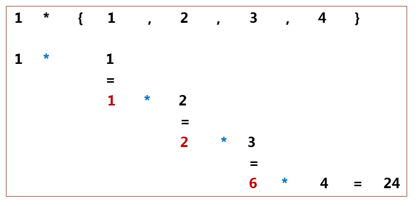

## Кои са основните сложности с примери?

Big O Notation | Name | Example(s)
------------ | ------------- | ---------
O(1) | Constant | **Odd or Even number** <br>**Look-up table (on average)**
O(log n) | Logarithmic | **Finding element on sorted array with binary search**
O(n) | Linear | **Find max element in unsorted array**
O(n log n) | Linearithmic | **Sorting elements in array with merge sort**
O($n^2$) | Quadratic | **Duplicate elements in array (naïve)**
O($n^3$) |	Cubic | **3 variables equation solver**
O($2^n$) |	Exponential	| **Find all subsets**
O(n!) | Factorial | **Find all permutations of a given set/string**

## Защо ме вълнува сложнстта?

| n | O(1) | O(log n) | O(n) | O(n log n) | O($n^2$) | O($2^n$) | O(n!)
| - | - | - | - | - | - | - | - 
| 1	        | < 1 sec |	< 1 sec |	< 1 sec	| < 1 sec	| < 1 sec	| < 1 sec	            | < 1 sec
| 10	        | < 1 sec |	< 1 sec |	< 1 sec	| < 1 sec	| < 1 sec	| < 1 sec	            | 4 sec
| 100	        | < 1 sec |	< 1 sec |	< 1 sec	| < 1 sec	| < 1 sec	| 40170 trillion years	| > vigintillion years
| 1,000	    | < 1 sec |	< 1 sec |	< 1 sec	| < 1 sec	| < 1 sec	| > vigintillion years	| > centillion years
| 10,000	    | < 1 sec |	< 1 sec |	< 1 sec	| < 1 sec	| 2 min	    | > centillion years	| > centillion years
| 100,000	    | < 1 sec |	< 1 sec |	< 1 sec	| 1 sec	    | 3 hours	| > centillion years	| > centillion years
| 1,000,000	| < 1 sec |	< 1 sec |	1 sec	| 20 sec	| 12 days	| > centillion years	| > centillion years

## Функции от по-висок ред. (Higher-order functions)
Функциите от по-висок ред са функции, които приемат функции като аргумент или връщат функции като резултат. Използват се във функционални езици за програмиране (какъвто C++ не е, но след C++ поддържа доста от функционалностите, например ламбда функции и ‘std::function’).

### Как?
С нещото наречено указател към функция.
```c++
void myIntFunc(int x)
{
    std::cout << x << std::endl;
}
 
int main()
{
    void (*foo)(int);
    /* the ampersand is actually optional */
    foo = &my_int_func;

    /* call myIntFunc (note that you do not need to write (*foo)(2) ) */
    foo(2);
    /* but if you want to, you may */
    (*foo)(2);
}
```

### А как ги подавам на други функции като праметър?

From the Linux man pages, we have the following declaration for qsort (from stdlib.h):
```c++
void qsort(void *base, size_t nmemb, size_t size,
           int(*compar)(const void *, const void *));
```

```c++
#include <stdlib.h>
 
int intSorter(const int *firstArg, const int *secondArg )
{
    int first = *firstArg, second = *secondArg;
    if (first < second)
    {
        return -1;
    }
    if (first == second)
    {
        return 0;
    }
    return 1;
}
 
int main()
{
    const int size = 10;
    int array[size];
    int i;
    /* fill array */
    for (i = 0; i < size; i++)
    {
        array[ i ] = size - i;
    }
    qsort(array, size, sizeof(int), intSorter);
    for (i = 0; i < size; i++)
    {
        std::cout << arr[i] << ' ';
    }
}
```

## Кои са някои от основните функции от по-висок ред, които правят живота ни по-лесен?

### map
```c++
std::vector<int> vec{1, 2, 3, 4, 5, 6, 7, 8, 9}
std::vector<string> str{"Programming", "in", "a", "functional", "style."}

std::transform(vec.begin(), vec.end(), vec.begin(),
              [](int i){ return i*i;} );
std::transform(str.begin(), str.end(), std::back_inserter(vec2),
     [](std::string s){ return s.length ();} );
```

### filter
```c++
auto it = std::remove_if(vec.begin(), vec.end (),
     [](int i){return ((i <3) or (i> 8))!});
auto it2 = std::remove_if(str.begin(),  str.end (), 
     [](std::string s) {return !(std::isupper (s[0]));});
```

### reduce (foldl)
```c++
std::accumulate(vec.begin(), vec.end(), 1,
                [](int a, int b){ return a*b; });  
std::accumulate(str.begin(), str.end(), string(""),
                [](std::string a,std::string b){ return a+":"+b; });
```



## std::function от functional 
Пример от [cppreference](https://en.cppreference.com/w/cpp/utility/functional/function)
```c++
#include <functional>
#include <iostream>
 
struct Foo {
    Foo(int num) : num_(num) {}
    void print_add(int i) const { std::cout << num_+i << '\n'; }
    int num_;
};
 
void print_num(int i)
{
    std::cout << i << '\n';
}
 
struct PrintNum {
    void operator()(int i) const
    {
        std::cout << i << '\n';
    }
};
 
int main()
{
    // store a free function
    std::function<void(int)> f_display = print_num;
    f_display(-9);
 
    // store a lambda
    std::function<void()> f_display_42 = []() { print_num(42); };
    f_display_42();
 
    // store the result of a call to std::bind
    std::function<void()> f_display_31337 = std::bind(print_num, 31337);
    f_display_31337();
 
    // store a call to a member function
    std::function<void(const Foo&, int)> f_add_display = &Foo::print_add;
    const Foo foo(314159);
    f_add_display(foo, 1);
    f_add_display(314159, 1);
 
    // store a call to a data member accessor
    std::function<int(Foo const&)> f_num = &Foo::num_;
    std::cout << "num_: " << f_num(foo) << '\n';
 
    // store a call to a member function and object
    using std::placeholders::_1;
    std::function<void(int)> f_add_display2 = std::bind( &Foo::print_add, foo, _1 );
    f_add_display2(2);
 
    // store a call to a member function and object ptr
    std::function<void(int)> f_add_display3 = std::bind( &Foo::print_add, &foo, _1 );
    f_add_display3(3);
 
    // store a call to a function object
    std::function<void(int)> f_display_obj = PrintNum();
    f_display_obj(18);
 
    auto factorial = [](int n) {
        // store a lambda object to emulate "recursive lambda"; aware of extra overhead
        std::function<int(int)> fac = [&](int n){ return (n < 2) ? 1 : n*fac(n-1); };
        // note that "auto fac = [&](int n){...};" does not work in recursive calls
        return fac(n);
    };
    for (int i{5}; i != 8; ++i) { std::cout << i << "! = " << factorial(i) << ";  "; }
}
```

# Задачи:
## Задача 1

Да се напише функция, която приема като аргумент масив от цели числа, броя на 
елементите и друга функция – `next(i)` (тя приема едно число и връща числото, което е с 3 по-
голямо от подаденото) и връща сумата на елементите, които се намират на индекси, кратни 
на `3`, индексите започват от `0`. 

Реализирайте сами функцията next и я използвайте в другата функция!


## Задача 2
Да се напише функция, която приема като аргумент масив от цели числа, броя на 
числата и двуаргументна булева функция `isDivisble(x, y)` (`isDivisible` проверява дали `x` се дели 
на `y` без остатък) и връща броя на всички двойки числа от масива, отговарящи на това 
условие.

Реализирайте сами функцията `isDivisble` и я използвайте в другата функция!

## Задача 3
Да се напише функция `map`, която приема като аргументи масив от цели числа, неговата 
размерност и едноаргументна функция operation,
и прилага функцията operation върху всеки един елемент на масива.

Да се реализира и втори път като функция, която връща нов масив, вместо да променя елементите на стария.

## Задача 4
Да се напише функция `filter`, която приема като аргументи масив от цели числа, неговата 
размерност и едноаргументен предикат, и връща нов масив с елементите от масива, отговарящи на предиката.

Да се измисли механизъм за връщане на големината на филтрирания масив.

## Задача 5
Да се напише функция `compose`, която приема като аргументи едноаргументна функция 
от тип `double` и цяло число `n`, и връща композицията на функцията `n` пъти.

## Задача 6
Да се напише функция, която приема масив от низове, броя на низовете и булева 
двуместна функция, която има за аргументи два низа. Функцията да изкарва на екрана 
низовете, подредени според наредбата зададена от двуместната функция.

**Example 1:**
```
Input:   4     
         i     
         love  
         eating
         pizza
Output:  eating
         i
         love
         pizza
```
## Задача 7
Дадени са естествените числа `m` и `n`, както и числовите едноаргументни функции `f` и `g` (`f` е диференцируема от произволен порядък). Като се използват специалната форма `lambda` и 
функцията `accumulate` (или sum/product), да се състави процедура, която дефинира 
функцията: x →∑k = 1
n
f(k)
(∏p=1
m
gp(x))  
където 
hk=h∘h∘...∘h⏟k пъти, а h(k)
 е k-тата производна на функцията h.


## Задача 8
Ако `f` и `g` са числови функции и n е естествено число, да се дефинира функция от повисок 
ред switchsum(n x f g), която връща като резултат функция, чиято стойност в дадена точка x е 
равна на f(x)+g(f(x))+f(g(f(x)))+ ... (сумата включва n събираеми).

**Example 1:**
```
f(x) = x + 1
g(x) = x * 2
 
switchsum(1, 2, f, g) → 3 
switchsum(2, 2, f, g) → 9 
switchsum(3, 2, f, g) → 16 
switchsum(4, 2, f, g) → 30
```