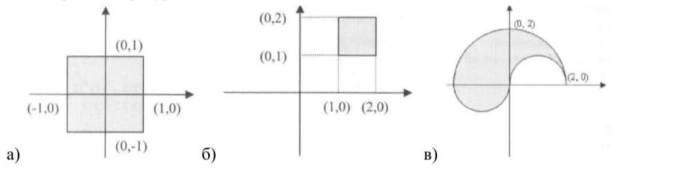
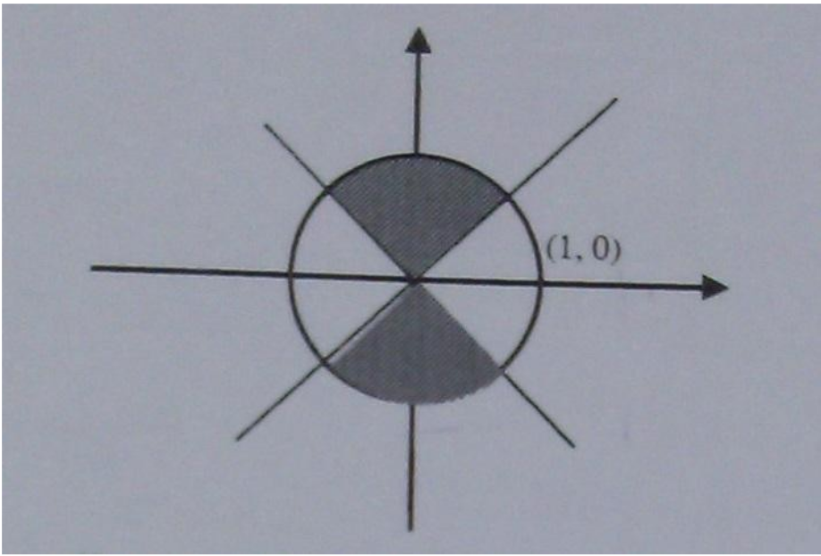
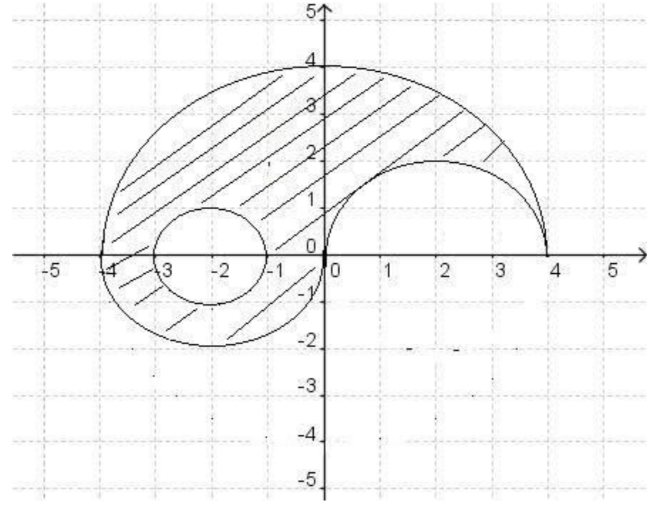

# FAQ
Как използваме `switch`?
```c++
int n = 5;
switch (n) {
    case 5:
        // do something ...
        break;
    case 6:
        // do something ...
        break;
    case 10 ... 20:
         // do something ...
        break;
    default: 
        // do something else ...
}
```

Как използваме `enum`?
```c++
// Sunny = 0, Windy = 1, Cloudy = 2
enum WeatherType { Sunny, Windy, Cloudy };
enum WeekDays { Sun = 7, Mon = 1, Thu, ... }; 
// Win = 1, Lose = 10, Draw = 11
enum GameResult { Win = 1, Lose = 10, Draw };
```
# Задача 1
Напишете програма, в която потребителя въвежда число `n`, след което на екрана се изписва това число на кой месец от годината съответства.

**Example 1:**
```c++
Input: 5
Output: May
```

# Задача 2
Да се напише програма, която приема две цели числа `n` и `m` и един от символите `+`, `-`, `*`, `/` или `%`. Ако символът, който е въведен е един от тях, да се извърши съответната операция върху двете числа. В противен случай да се изведе съобщение за невалиден символ.

**Example 1:**
```c++
Input: n = 5, m = 12, op = '-'
Output: -7
```

**Example 2:**
```c++
Input: n = 1, m = 2, op = '*'
Output: -2
```

**Example 3:**
```c++
Input: n = 5, m = 12, op = '@'
Output: Error message
```

**Example 4:**
```c++
Input: n = 1, m = 0, op = '/'
Output: Division by zero
```

# Задача 3
По дадени:
- ден и номер на месец от годината да се изведете зодията на човек. 
- число – пореден номер на зодия, като се започва от 1-ви номер за Козирог и завършва с последен 12-ти за Стрелец да се изведат дните, в които е зодията.


**Example 1:**
```c++
Input: day = 7, month = 5
Output: Taurus
```

**Example 2:**
```c++
Input: sign = 5
Output: Apr 20 - May 20
```

# Задача 4
Напишете програма, в която потребителя въвежда числa `n`, `k`, `m`, `y`, където n e ден от месец, k е ден от седмицата, m е месец и y е година и извежда датата в посочения формат: DD/EE/Mon/YYYY   


**Example 1:**
```c++
Input: 15 4 6 2005
Output: 15 Thu Jun 2005
```

**Constraints:**
- `1 <= n <= 31`
- `1 <= k <= 7`
- `1 <= m <= 12`
- `y > 0`

# Задача 5
Даден е правоъгълник, зададен по координатите на точки на долния ляв `lx` и `ly` и горния десен ъгъл `rx` и `ry`. Да се напише програма, която по зададени координати на точка `x` и `y`, определя дали тя принадлежи на вътрешността на правоъгълника (заедно с контура).


**Example 1:**
```c++
Input: bottomLeft = (0, 0), topRight = (2, 2), point = (1.53, 2)
Output: Inside
```
**Example 2:**
```c++
Input: bottomLeft = (0, 0), topRight = (2, 2), point = (-5, -1.53)
Output: Outside
```

**Example 3:**
```c++
Input: bottomLeft = (3, 3), topRight = (2, 2), point = (1.53, 2)
Output: Invalid input 
```


# Задача 6
Да се напише програма, която проверява дали въведена от клавиатурата точка скоординати x и y принадлежи на защрихованата част от чертежа. След като проверката е направена, да се изведе подходящ текст.



**Example 1:**
```c++
Input: pointA = (0.5, 0.5), pointB = (1.5, 1.5), pointC = (-1, -1)
Output: Inside Inside Inside
```

А дали принадлежи на тези фигури?


