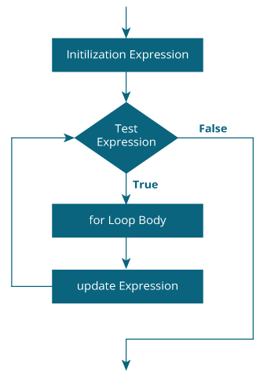
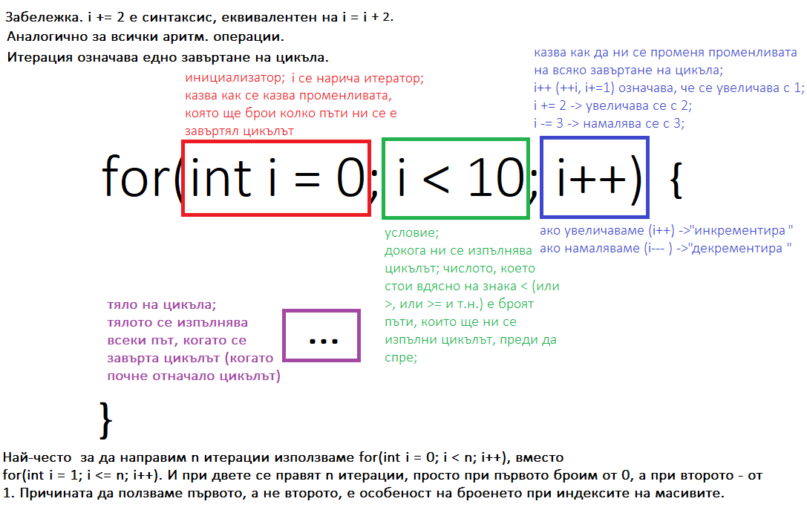

# Теория 

```c++
    // 32 bit integer, we only work with the first byte
    // int mask0 = 1 << 0; // 0000 0001
    // int mask1 = 1 << 1; // 0000 0010
    // int mask2 = 1 << 2; // 0000 0100
    // int mask3 = 1 << 3; // 0000 1000
    // int mask4 = 1 << 4; // 0001 0000
    // int mask5 = 1 << 5; // 0010 0000
    // int mask6 = 1 << 6; // 0100 0000
    // int mask7 = 1 << 7; // 1000 0000

    // binary literal
    int mask0 = 0b0000'0001; // 0000 0001
    int mask1 = 0b0000'0010; // 0000 0010
    int mask2 = 0b0000'0100; // 0000 0100
    int mask3 = 0b0000'1000; // 0000 1000
    int mask4 = 0b0001'0000; // 0001 0000
    int mask5 = 0b0010'0000; // 0010 0000
    int mask6 = 0b0100'0000; // 0100 0000
    int mask7 = 0b1000'0000; // 1000 0000

    // hexadecimal
    // int mask0 = 0x1; // 0000 0001
    // int mask1 = 0x2; // 0000 0010
    // int mask2 = 0x4; // 0000 0100
    // int mask3 = 0x8; // 0000 1000
    // int mask4 = 0x10; // 0001 0000
    // int mask5 = 0x20; // 0010 0000
    // int mask6 = 0x40; // 0100 0000
    // int mask7 = 0x80; // 1000 0000

    // std::cout << mask0 << " " << mask1 << " " << mask2 << '\n';

    int flags = 0b0000'0101; // 8 bits in size means room for 8 flags

    // testing a bit to see if it's on or off
    int n = 5;
    std::cout << n << "th bit is " << ((flags >> (n - 1)) & 1 ? "on\n" : "off\n");
    std::cout << "bit 0 is " << ((flags & mask0) ? "on\n" : "off\n");
    std::cout << "bit 1 is " << ((flags & mask1) ? "on\n" : "off\n");

    // setting a bit
    flags |= mask1; // turn on bit 1
    std::cout << "bit 1 is " << ((flags & mask1) ? "on\n" : "off\n");
    flags |= (mask4 | mask5); // turn bits 4 and 5 on at the same time

    // turining bits off
    flags &= ~mask2; // turn off bit 2
    std::cout << "bit 2 is " << ((flags & mask2) ? "on\n" : "off\n");
    flags &= ~(mask4 | mask5); // turn bits 4 and 5 off at the same time

    // flipping a bit
    std::cout << "bit 2 is " << ((flags & mask2) ? "on\n" : "off\n");
    flags ^= mask2; // flip bit 2
    std::cout << "bit 2 is " << ((flags & mask2) ? "on\n" : "off\n");
    flags ^= mask2; // flip bit 2
    std::cout << "bit 2 is " << ((flags & mask2) ? "on\n" : "off\n");
    flags ^= (mask4 | mask5); // flip bits 4 and 5 at the same time

    // bit masks involving multiple bits
    unsigned int redBits = 0xFF000000;
    unsigned int greenBits = 0x00FF0000;
    unsigned int blueBits = 0x0000FF00;
    unsigned int alphaBits = 0x000000FF;

    std::cout << "Enter a 32-bit RGBA color value in hexadecimal (e.g. FF7F3300): ";
    unsigned int pixel;

    std::cin >> std::hex >> pixel; // std::hex allows us to read in a hex value

    // use Bitwise AND to isolate red pixels,
    // then right shift the value into the lower 8 bits
    // (we're not using brace initialization to avoid a static_cast)
    unsigned int red = (pixel & redBits) >> 24;
    unsigned int green = (pixel & greenBits) >> 16;
    unsigned int blue = (pixel & blueBits) >> 8;
    unsigned int alpha = pixel & alphaBits;

    std::cout << "Your color contains:\n";
    std::cout << std::hex; // print the following values in hex
    std::cout << red << " red\n";
    std::cout << green << " green\n";
    std::cout << blue << " blue\n";
    std::cout << alpha << " alpha\n";
```

## Задача 1

```c++
//     Given the following program:

   int main()
   {
      int option_viewed{ 0x01 };
      int option_edited{ 0x02 };
      int option_favorited{ 0x04 };
      int option_shared{ 0x08 };
      int option_deleted{ 0x10 };

      int myArticleFlags;

   }

    // a) Write a line of code to set the article as viewed.


    // b) Write a line of code to check if the article was deleted.


    // c) Write a line of code to clear the article as a favorite.


    // d) why are the following two lines identical?

    // myflags &= ~(option4 | option5); // turn options 4 and 5 off
    // myflags &= ~option4 & ~option5; // turn options 4 and 5 off
```

# Loops



```c++
    // for (initializationStatement; testExpression; updateStatement)
    // {
    //     // statements inside the body of loop
    // }

    for (int i = 0; i < 10; i++)
    {
        std::cout << i << " ";
    }
    std::cout << std::endl;

    // task -> is sum(0 ... n) including == (n*(n-1)) / 2 ??
    int sum = 0;
    for (int i = 0; i <= 10; i++)
    {
        sum += i;
    }
    std::cout << std::boolalpha << (sum == (10 * 11) / 2) << "\n";
   ```




   ```c++

    //     while (testExpression)
    // {
    //     // statements inside the body of the loop
    // }

    int i = 0;
    while (i <= 5)
    {
        std::cout << i << " ";
        i++;
    }
    std::cout << std::endl;
```


```c++
    // do
    // {
    //    // statements inside the body of the loop
    // }
    // while (testExpression);

    double number, sum1 = 0;
    do
    {
        std::cout << "Enter a number: ";
        std::cin >> number;
        sum1 += number;
    } while (number != 0.0);
    std::cout << sum1 << "\n";

    // validation
    // enter a number between 2^10 = 1024 and 2^13 = 8172

    do
    {
        std::cin >> number;
    } while (number < 1 << 10 || number > 1 << 13);
    std::cout << "Your number is: " << number << "\n";
```


```c++
    // break
    int num;
    sum = 0;
    for (int i = 1; i <= 10; ++i)
    {
        std::cout << "Enter a number: ";
        std::cin >> num;

        // if the user enters a negative number, break the loop
        if (number < 0.0)
        {
            break;
        }

        sum += number; // sum = sum + number;
    }
    std::cout << sum << "\n";
```


```c++
   // continue
   
    sum = 0;
    for (int i = 1; i <= 10; ++i)
    {
        std::cout << "Enter a number: ";
        std::cin >> num;

        // if the user enters a negative number, skip it
        if (number < 0.0)
        {
            continue;
        }

        sum += number; // sum = sum + number;
    }
    std::cout << sum << "\n";
```
