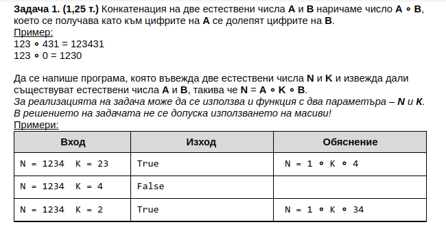
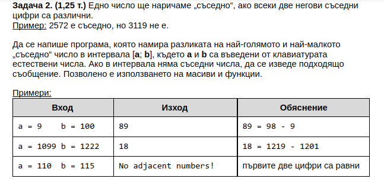
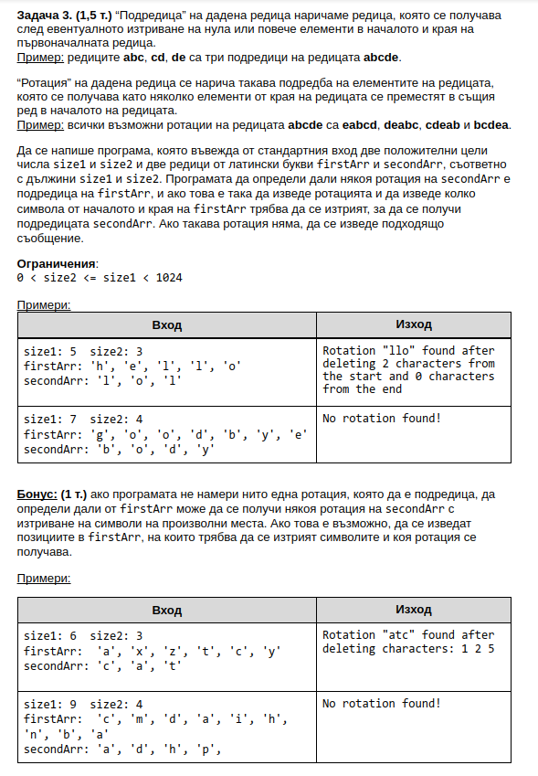

# Задача 1
Напишете програма, която по подадени две цели числа `a` и `b` намира броя на числата в интервала `[a, b]`, за които броят на различните им делители, без едно и самото число, е просто число. 

**Example 1:**
```
Input: a = 20, b = 30
Output: 4
```

# Задача 2
Смешно число е такова число, при което няма две съседни цифри с еднаква четност. Например числото `123` е смешно, но числото `235` не е.
Напишете програма, която по подадени две цели числа `a` и `b` намира сумата на числата в интервала `[a, b]`, чийто сбор на цифрите е смешно число.

# Задача 3
Напишете програма, която прочита от стандартния вход размера (цяло число `n`, по-малко от `1000000`) и елементите на масив от цели числа. След това трябва да се провери дали има число `k < n`, такова че всички числа в масива, намиращи се на разстояние `k` едно от друго се различават по стойност точно с `k` - (например ако `k = 2`, то модул от разликата на числата на позиции `i` и `i + 2` трябва да е `2`). Ако има такова `k`, изведете го на екрана. При повече от една стойност на `k` с това свойство изведете най-голямата. Ако няма, изведете "No solution".


# Задача 4
Напишете програма, която симулира движение на кон по шахматна дъска. За целта ще трябва да проверите дали подадена последователност от двойки числа - координати върху дъската - е валидна поредица от позиции на шахматен кон (т.е. конят може да се придвижи от дадена позиция до следващата).
Задачата ви е да прочетете естествено число `n`, което ще е по-малко от `50000`, следвано от `2 * n` числа, всяко между `1` и `8`, които определят позиция на шахматната дъска. След това трябва да проверите дали тези числа определят валидна последователност от позиции на кон на шахматна дъска. Ако това е така изведете `Yes`. Ако не е проверете дали има такава произволна двойка числа, след премахване на която оставащите `2 * n` - 2 числа са валидна редица от ходове на кон. Ако това е така, изведете индексите на тези две числа. Припомняме, че шахматния кон се движи с по две полета по хоризонтала и едно по вертикала или с едно по хоризонтала и две по вертикала.

**Example 1:**
```
Input: n = 3, 1 1 3 5 2 3
Output: 3 5
```



